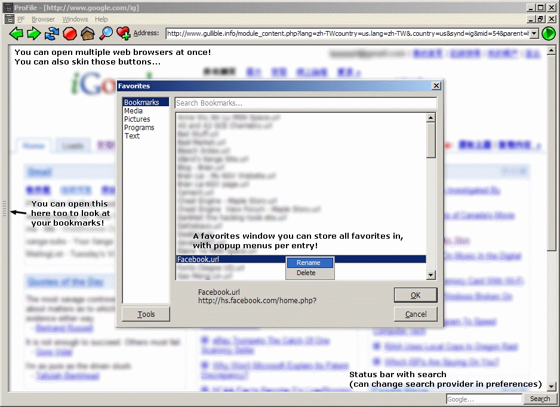



## App ProFile V2\.9 \- Program which does everything but still under 100kb\!

### Description

Extremely versatile open source project. Does not run when any OCX is missing because Im not using any, yet this program is able to open all media files your media player can, text files, images, web browser and more. Extensive INI interface with editor (called preferences), as well as multiple backing tools, skinning, event audio feedback (e.g. when you open a new window, a chime will sound)... Update Aug 15: Added lots of features, including "Virtual ListView" without ListView control.
 
### More Info
 

             |
---                |---
**Submitted On**   |2007-08-15 00:38:44
**By**             |[Brian Lai](https://github.com/Planet-Source-Code/PSCIndex/blob/master/ByAuthor/brian-lai.md)
**Level**          |Intermediate
**User Rating**    |4.7 (33 globes from 7 users)
**Compatibility**  |VB 5\.0, VB 6\.0
**Category**       |[Complete Applications](https://github.com/Planet-Source-Code/PSCIndex/blob/master/ByCategory/complete-applications__1-27.md)
**World**          |[Visual Basic](https://github.com/Planet-Source-Code/PSCIndex/blob/master/ByWorld/visual-basic.md)
**Archive File**   |[App\_ProFil2079588152007\.zip](https://github.com/Planet-Source-Code/brian-lai-app-profile-v2-9-program-which-does-everything-but-still-under-100kb__1-68799/archive/master.zip)

### API Declarations

see code

